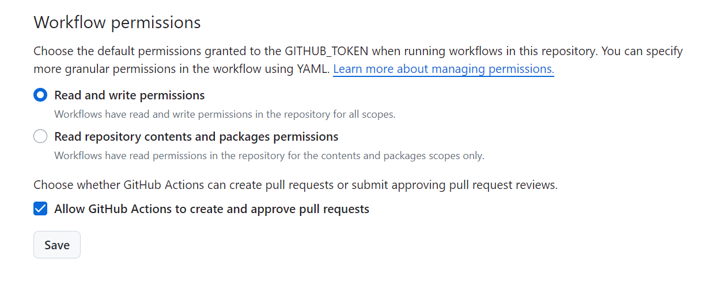

# Resume

Welcome to the **Resume** Repository! This project automates the process of generating polished, themed PDF resumes using structured data from `resume.json`. The entire workflow is driven by GitHub Actions, ensuring that your resumes are always up-to-date with minimal manual effort.

## Getting Started

Follow these steps to quickly start working on this project:

1. **Fork the Repository**:
   - Start by [forking this repository](https://github.com/AJLab-GH/resume/fork) to your own GitHub account.

2. **Clone the Repository**:
   - Clone the forked repository to your local machine:

     ```bash
     git clone https://github.com/AJLab-GH/resume.git
     cd resume
     ```

3. **Setting GitHub Action Permissions**

To ensure your GitHub Actions have the necessary permissions to commit changes back to the repository and create pull requests, follow these steps:

  **Navigate to Repository Settings**:

- In your GitHub repository, go to `Settings`.

  **Configure Workflow Permissions**:

- Under `Actions`, select `General`.
- In the `Workflow permissions` section, choose **Read and write permissions**.
- Enable the option **Allow GitHub Actions to create and approve pull requests**.

   

4. **Make Your Change**:
   - Update the `resume.json` file with your resume details. This file serves as the single source of truth for your resume content.

5. **Add, Commit, and Push Your Changes**:
   - Stage and commit your changes:

     ```bash
     git add resume
     git commit -m "Update resume"
     git push origin main
     ```

6. **See Your New Resumes**:
   - Once your changes are pushed, GitHub Actions will automatically generate new PDF and HTML resumes based on the themes specified in `source/themes.json`. You can find the generated resumes in the `outputs/pdf` and `outputs/html` folders.

## How It Works

This repository leverages the power of GitHub Actions to build multiple PDF resumes based on the data found in `source/resume.json`. The themes used for these resumes are defined in `source/themes.json`, making it easy to switch between different designs.

### Key Steps

- **Data-Driven Resumes**: The `source/resume.json` file follows a schema compatible with various themes, ensuring consistent formatting across different designs.
  
- **Automated Workflow**: Every time a change is committed to the `main` branch, a GitHub Action is triggered. This action automates the entire process:
  - Installs the necessary packages and themes.
  - Generates PDF and HTML resumes for each theme specified in `source/themes.json`.
  - Commits the generated resumes back to the `main` branch, organized in the `outputs/pdf` and `outputs/html` folders.

## Why This Approach?

This repository is inspired by [rmordasiewicz's](https://github.com/rmordasiewicz) approach. The key idea is to separate content from design and automation, making collaboration easier and more efficient.

- **Focus on Content**: Spend less time on technical details and more time perfecting the content of your resume.
- **Consistency**: Ensure that all themed resumes are consistently updated with the latest information.
- **Efficiency**: Automate repetitive tasks, so you can focus on what matters most.

### Security Considerations

Initially, the project used a `doit.sh` script to automate resume generation. However, due to security concerns with outdated libraries and the need for Puppeteer to use the `--no-sandbox` flag, the logic was moved into GitHub Actions. This provides a safer and more controlled environment, ensuring that dependencies are up-to-date and that the automation process is secure.

## Contributing

Contributions are welcome! If you have suggestions for improving the workflow, adding new themes, or enhancing the documentation, feel free to open a pull request.

## License

This project is open-source and available under the [MIT License](LICENSE).
